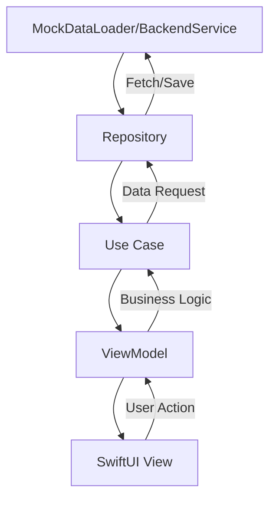

# BoxBurnSuplements Documentation

## Introduction
BoxBurnSuplements is a modern iOS app for discovering, searching, and purchasing nutritional supplements. It is designed for fitness enthusiasts, athletes, and anyone interested in supplement shopping. The app aims to provide a seamless, Amazon-like experience with robust architecture, high test coverage, and easy extensibility.

## Project Goals
- Deliver a clean, maintainable, and testable codebase
- Provide a delightful, responsive, and accessible user experience
- Support easy localization and backend integration
- Achieve 80%+ code coverage with meaningful tests

## Target Users
- Fitness enthusiasts, athletes, and supplement shoppers
- Developers seeking a reference for Clean Architecture and modern Swift best practices

---

## Detailed Architecture

### Clean Architecture Layers
- **Domain Layer**: Business logic, use cases, and core models (e.g., `Supplement`, `CartItem`, `FavoritesUseCase`)
- **Data Layer**: Data sources, repositories, backend services, and mock data loaders (e.g., `MockSupplementRepository`, `BackendService`)
- **Presentation Layer**: SwiftUI views, view models, UI components, and extensions (e.g., `SupplementListViewModel`, `RootView`)

### SOLID Principles
- **Single Responsibility**: Each class/struct has one clear purpose
- **Open/Closed**: Easily extend features (e.g., new categories, repositories)
- **Liskov Substitution**: Protocols for repositories and use cases
- **Interface Segregation**: Small, focused protocols
- **Dependency Inversion**: High-level modules depend on abstractions, not concrete implementations

### Combine & SwiftUI
- **Combine**: Used for reactive data flow between repositories, use cases, and view models
- **SwiftUI**: Declarative UI, state-driven, and modular components
- **Dependency Injection**: View models and use cases are injected with repositories/services for testability

---

## Data Flow



- **MockDataLoader** loads categories and supplements from JSON
- **Repository** abstracts data source (mock or real backend)
- **Use Cases** encapsulate business logic (fetch, favorites, cart)
- **ViewModel** exposes state and actions to SwiftUI views
- **SwiftUI Views** render UI and trigger actions via view models

---

## UI/UX
- **Navigation**: Tab bar for main sections, side menu for settings and navigation
- **Amazon-like Design**: Modern cards, product images, and clear CTAs
- **Localization**: All user-facing strings are localized (PT-BR default)
- **Accessibility**: Uses SwiftUI best practices for accessibility
- **Responsive**: Adapts to different device sizes

---

## Testing
- **Philosophy**: Test all business logic, data, and UI components
- **Tools**: [SwiftTesting](https://github.com/apple/swift-testing), Combine, async/await
- **Structure**: Tests mirror main codebase (Domain, Data, Presentation)
- **Coverage**: 80%+ code coverage, including edge cases and error handling

---

## Extensibility
- **Add Categories**: Update `mock_data.json` and `SupplementCategory`
- **Add Backend**: Implement real repository/service, swap via dependency injection
- **Add Languages**: Extend `Resources/Localizable.strings`
- **Add Features**: Create new use cases, view models, and SwiftUI views

---

## File/Folder Structure
```
BoxBurnSuplements/
  BoxBurnSuplements/
    Data/         # Repositories, services, data loaders
    Domain/       # Models, use cases, protocols
    Presentation/ # View models, SwiftUI views, components
    Resources/    # Assets, localization, mock data
  BoxBurnSuplementsTests/
    Data/
    Domain/
    Presentation/
  README.md
  CHANGELOG.md
  TESTS.md
  DOCUMENTATION.md
```

---

## Example Flows

### 1. Loading Supplements
- App launches
- `MockDataLoader` loads supplements from JSON
- `MockSupplementRepository` provides data to `FetchSupplementsUseCase`
- `SupplementListViewModel` receives supplements and updates UI

### 2. Adding to Cart
- User taps "Add to Cart" on a supplement
- `SupplementListViewModel` calls `CartUseCase.addToCart`
- Repository updates cart, view model updates UI

### 3. Marking as Favorite
- User taps favorite icon
- `SupplementListViewModel` calls `FavoritesUseCase.toggleFavorite`
- Repository updates favorites, view model updates UI

---

## Contribution
- Fork, branch, and submit PRs
- Follow Clean Architecture and SOLID
- Add/maintain tests for new features
- Use clear commit messages and update documentation

---

## References
- [SwiftTesting](https://github.com/apple/swift-testing)
- [Clean Architecture](https://8thlight.com/blog/uncle-bob/2012/08/13/the-clean-architecture.html)
- [Combine](https://developer.apple.com/documentation/combine)
- [SwiftUI](https://developer.apple.com/xcode/swiftui/) 